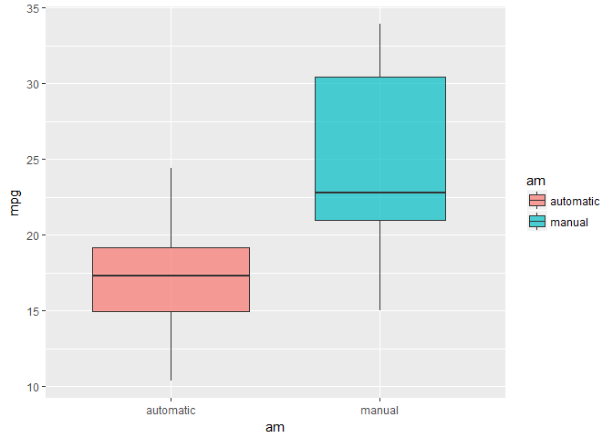
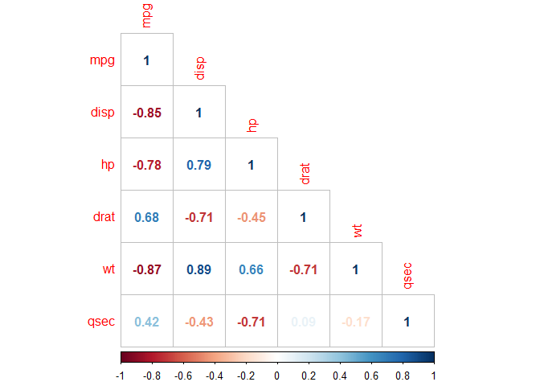

# Coursera - Regression Models Assignment
Arkadiusz Oliwa  
20 march 2018  


```r
library(dplyr)
library(ggplot2)
library(corrplot)
library(formattable)
```

## Executive summary

In this assignment I compared manual transmission and automatic transmission for MPG (Miles/US galon). There was used simple exploratory analysis as well as hypothesis testing and linear regression. As you can see in this paper having a manual car cause increase in MPG in comparison automatic transmission.

## Dataset

The data was extracted from the 1974 Motor Trend US magazine, and comprises fuel consumption and 10 aspects of automobile design and performance for 32 automobiles


```r
mtcars %>%
  formattable(align="l") %>%
  as.datatable()
```

<!--html_preserve--><div id="htmlwidget-3a277a3abc8ed3375b6e" style="width:100%;height:auto;" class="datatables html-widget"></div>
<script type="application/json" data-for="htmlwidget-3a277a3abc8ed3375b6e">{"x":{"filter":"none","data":[["Mazda RX4","Mazda RX4 Wag","Datsun 710","Hornet 4 Drive","Hornet Sportabout","Valiant","Duster 360","Merc 240D","Merc 230","Merc 280","Merc 280C","Merc 450SE","Merc 450SL","Merc 450SLC","Cadillac Fleetwood","Lincoln Continental","Chrysler Imperial","Fiat 128","Honda Civic","Toyota Corolla","Toyota Corona","Dodge Challenger","AMC Javelin","Camaro Z28","Pontiac Firebird","Fiat X1-9","Porsche 914-2","Lotus Europa","Ford Pantera L","Ferrari Dino","Maserati Bora","Volvo 142E"],["21.0","21.0","22.8","21.4","18.7","18.1","14.3","24.4","22.8","19.2","17.8","16.4","17.3","15.2","10.4","10.4","14.7","32.4","30.4","33.9","21.5","15.5","15.2","13.3","19.2","27.3","26.0","30.4","15.8","19.7","15.0","21.4"],["6","6","4","6","8","6","8","4","4","6","6","8","8","8","8","8","8","4","4","4","4","8","8","8","8","4","4","4","8","6","8","4"],["160.0","160.0","108.0","258.0","360.0","225.0","360.0","146.7","140.8","167.6","167.6","275.8","275.8","275.8","472.0","460.0","440.0","78.7","75.7","71.1","120.1","318.0","304.0","350.0","400.0","79.0","120.3","95.1","351.0","145.0","301.0","121.0"],["110","110","93","110","175","105","245","62","95","123","123","180","180","180","205","215","230","66","52","65","97","150","150","245","175","66","91","113","264","175","335","109"],["3.90","3.90","3.85","3.08","3.15","2.76","3.21","3.69","3.92","3.92","3.92","3.07","3.07","3.07","2.93","3.00","3.23","4.08","4.93","4.22","3.70","2.76","3.15","3.73","3.08","4.08","4.43","3.77","4.22","3.62","3.54","4.11"],["2.620","2.875","2.320","3.215","3.440","3.460","3.570","3.190","3.150","3.440","3.440","4.070","3.730","3.780","5.250","5.424","5.345","2.200","1.615","1.835","2.465","3.520","3.435","3.840","3.845","1.935","2.140","1.513","3.170","2.770","3.570","2.780"],["16.46","17.02","18.61","19.44","17.02","20.22","15.84","20.00","22.90","18.30","18.90","17.40","17.60","18.00","17.98","17.82","17.42","19.47","18.52","19.90","20.01","16.87","17.30","15.41","17.05","18.90","16.70","16.90","14.50","15.50","14.60","18.60"],["0","0","1","1","0","1","0","1","1","1","1","0","0","0","0","0","0","1","1","1","1","0","0","0","0","1","0","1","0","0","0","1"],["1","1","1","0","0","0","0","0","0","0","0","0","0","0","0","0","0","1","1","1","0","0","0","0","0","1","1","1","1","1","1","1"],["4","4","4","3","3","3","3","4","4","4","4","3","3","3","3","3","3","4","4","4","3","3","3","3","3","4","5","5","5","5","5","4"],["4","4","1","1","2","1","4","2","2","4","4","3","3","3","4","4","4","1","2","1","1","2","2","4","2","1","2","2","4","6","8","2"]],"container":"<table class=\"display\">\n  <thead>\n    <tr>\n      <th> <\/th>\n      <th>mpg<\/th>\n      <th>cyl<\/th>\n      <th>disp<\/th>\n      <th>hp<\/th>\n      <th>drat<\/th>\n      <th>wt<\/th>\n      <th>qsec<\/th>\n      <th>vs<\/th>\n      <th>am<\/th>\n      <th>gear<\/th>\n      <th>carb<\/th>\n    <\/tr>\n  <\/thead>\n<\/table>","options":{"order":[],"autoWidth":false,"orderClasses":false,"columnDefs":[{"orderable":false,"targets":0}]}},"evals":[],"jsHooks":[]}</script><!--/html_preserve-->


## Simple exploratory data analysis

Table  and box plot show car transmission types by  MPG. As you can see there is increase in MGP for manual transmission in comparison to automatic transmission


```r
mtcars %>%
  mutate(Transmission = ifelse(am == 0, no = "manual", yes = "automatic")) %>%
  group_by(Transmission) %>%
  summarise(median = median(mpg), mean = mean(mpg), sd = sd(mpg), min = min(mpg), max = max(mpg)) %>%
  formattable(align="l")
```


<table class="table table-condensed">
 <thead>
  <tr>
   <th style="text-align:left;"> Transmission </th>
   <th style="text-align:left;"> median </th>
   <th style="text-align:left;"> mean </th>
   <th style="text-align:left;"> sd </th>
   <th style="text-align:left;"> min </th>
   <th style="text-align:left;"> max </th>
  </tr>
 </thead>
<tbody>
  <tr>
   <td style="text-align:left;"> automatic </td>
   <td style="text-align:left;"> 17.3 </td>
   <td style="text-align:left;"> 17.14737 </td>
   <td style="text-align:left;"> 3.833966 </td>
   <td style="text-align:left;"> 10.4 </td>
   <td style="text-align:left;"> 24.4 </td>
  </tr>
  <tr>
   <td style="text-align:left;"> manual </td>
   <td style="text-align:left;"> 22.8 </td>
   <td style="text-align:left;"> 24.39231 </td>
   <td style="text-align:left;"> 6.166504 </td>
   <td style="text-align:left;"> 15.0 </td>
   <td style="text-align:left;"> 33.9 </td>
  </tr>
</tbody>
</table>


```r
mtcars %>%
  mutate(am = ifelse(am == 0, no = "manual", yes = "automatic")) %>%
  ggplot(aes(y = mpg, x = am, fill = am)) +
  geom_boxplot(alpha = .7, varwidth = TRUE) 
```

<!-- -->

We can also see  that there is linear correlation between mpg and the variables disp, hp, wt (strong negative) and drat (strong positive)  


```r
corrplot(corr = cor(mtcars[, c("mpg", "disp", "hp", "drat", "wt", "qsec")], 
                    method = "pearson"), 
         method = "number", type = "lower")
```

<!-- -->


## Hypothesis testing

I’m interested in if the average value of MPG  differs significantly from a manual and  automatic transmission within a defined confidence level 0.05


```r
t.test(formula = mpg ~ am, data = mtcars)
```

```
## 
## 	Welch Two Sample t-test
## 
## data:  mpg by am
## t = -3.7671, df = 18.332, p-value = 0.001374
## alternative hypothesis: true difference in means is not equal to 0
## 95 percent confidence interval:
##  -11.280194  -3.209684
## sample estimates:
## mean in group 0 mean in group 1 
##        17.14737        24.39231
```

The p-value is 0.001374 so we reject the null hypothesis and we inference that there is a significant statistical difference in the mean MPG between manual transmission cars and that of automatic transmission cars

## Linear regression

I’m going to use function step() to automatically choose the best model by AIC criterion in a stepwise algorithm


```r
fit <- step(object = lm(formula = mpg ~ ., data = mtcars), direction = "both")
```


Based on diagnostic plots we can say that residual are normally distributed and homoskedastic. 


```r
par(mfrow=c(2,2))
plot(fit)
```

<!-- -->


```r
summary(fit)
```

```
## 
## Call:
## lm(formula = mpg ~ wt + qsec + am, data = mtcars)
## 
## Residuals:
##     Min      1Q  Median      3Q     Max 
## -3.4811 -1.5555 -0.7257  1.4110  4.6610 
## 
## Coefficients:
##             Estimate Std. Error t value Pr(>|t|)    
## (Intercept)   9.6178     6.9596   1.382 0.177915    
## wt           -3.9165     0.7112  -5.507 6.95e-06 ***
## qsec          1.2259     0.2887   4.247 0.000216 ***
## am1           2.9358     1.4109   2.081 0.046716 *  
## ---
## Signif. codes:  0 '***' 0.001 '**' 0.01 '*' 0.05 '.' 0.1 ' ' 1
## 
## Residual standard error: 2.459 on 28 degrees of freedom
## Multiple R-squared:  0.8497,	Adjusted R-squared:  0.8336 
## F-statistic: 52.75 on 3 and 28 DF,  p-value: 1.21e-11
```

Looking at result we can say that:
The adjusted R-squared for the model is 0.8336, and the three variables coefficients are all significant at the 5% confidence level. 
Based on coefficients we can say that having a manual car we gain 2.9358 MPG above that of an automatic 


